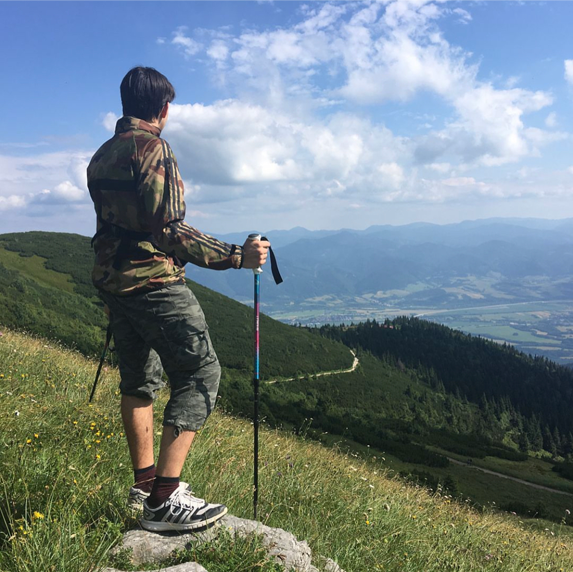

# Visual storytelling is my passion:
- [**ABOUT ME**](https://github.com/BenjaminHaverla/First-impression-presentation/blob/main/README.md#benjamín-haverla-filmmaker)
- [**FEATURED PROJECTS**](https://github.com/BenjaminHaverla/First-impression-presentation/blob/main/README.md#about-my-featured-projects)

## Benjamín Haverla – Filmmaker:

In my homeland of Slovakia, the gift of nature inspires my creativity. To learn more about me, [click](https://github.com/BenjaminHaverla/About-me.git) without hesitation.

## ABOUT MY FEATURED PROJECTS:

My main career goal is to become a film director. I'm aware of the thorny path, a journey intertwined with my passion. That's why I would like to share with you my small steps:

- "We want to live!" (I was 14 years old) –> I entered my first animated LEGO short film into a Bratislava Slovak competition. We were awarded with 3rd place. I believe that we won thanks to the cooperation of my friends.
  
- "World of Plastic" (I was 15 years old) –> Animated LEGO short film. We were awarded 1st place in the Bratislava Slovak competition.

- "Life with ISIC" (I was 16 years old) –> Music video about ISIC student card. We were awarded 1st place in the Košice Slovak competition. Thanks to this, I had the opportunity to be the main actor in short ISIC ads.

- **"Mystery House trailer"** (2017 – I was 16 years old) –> We were awarded 1st place in Czechoslovak competition.
  
- "1 DAY" (I was 18 years old) –> Live-action short film. We were awarded 2nd place in the Košice Slovak competition.

In 2020, word about me and my work reached some people, leading me to create videos for clients. Over time, I created my first international short film, blending live-action and animated elements. Garnering awards and nominations, I chose to step into the background actor role, gaining insights into larger-scale film productions. Subsequently, I became an Animation/Film instructor for a kids' camp, held annually for one week. Currently, I'm gaining valuable experience as an intern in Berlin with Erasmus+. During this period, I'm also preparing a new international music video. To learn more, [click](https://github.com/BenjaminHaverla/Portfolio.git) without hesitation.

# The project I'm working on (2023 – ???)

## Storyboard

# UKUPHILA – experimental project (2021)

# The performance in Add (2018)

