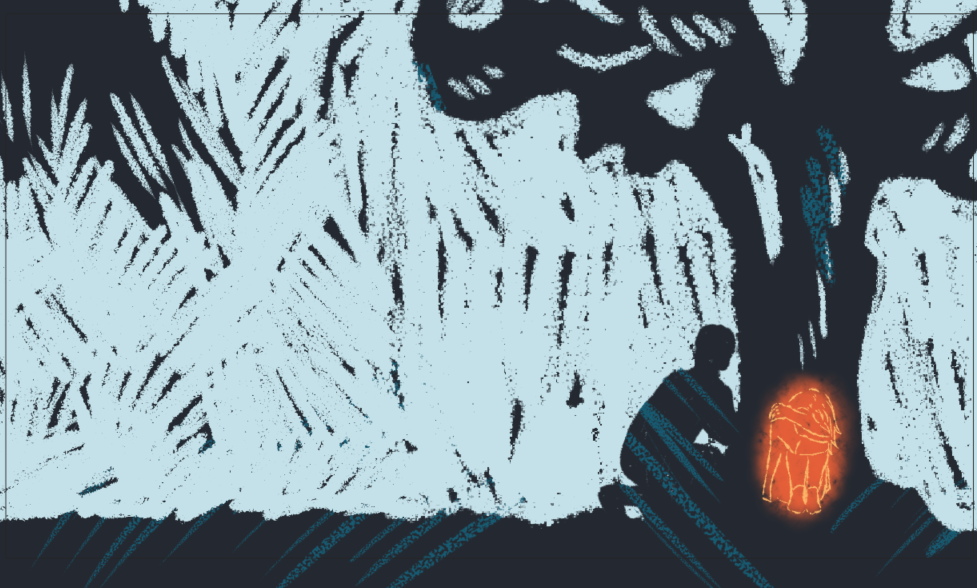

# Visual storytelling is my passion:
- **ABOUT ME**
- **FEATURED PROJECTS**

## Benjamín Haverla – Filmmaker:

In my homeland of Slovakia, the gift of nature inspires my creativity. To learn more about me, click without hesitation.

## ABOUT MY FEATURED PROJECTS:

My main career goal is to become a film director. I'm aware of the thorny path, a journey intertwined with my passion. That's why I would like to share with you my small steps:

- "We want to live!" (I was 14 years old) –> I entered my first animated LEGO short film into a Bratislava Slovak competition. We were awarded with 3rd place. I believe that we won thanks to the cooperation of my friends.
  
- "World of Plastic" (I was 15 years old) –> Animated LEGO short film. We were awarded 1st place in the Bratislava Slovak competition.

- "Life with ISIC" (I was 16 years old) –> Music video about ISIC student card. We were awarded 1st place in the Košice Slovak competition. Thanks to this, I had the opportunity to be the main actor in short ISIC ads.
  
- "1 DAY" (I was 18 years old) –> Live-action short film. We were awarded 2nd place in the Košice Slovak competition.

In 2020 some people heard about me and my work and I started to create videos for some clients. After some time 

- Direktorenhaus (current work)
- Ai video labs (current work)
- Animation/Film instructor for kid's camp (one week per year)

**ABOUT** –> My name is Benjamín Haverla, and I live in Martin, Slovakia. I studied Information and Digital Technologies at Private Secondary Technical School in Poprad, founded by the Tatra Academy n. o. Currently, I am studying at the University of Creative Communication in Prague. I specialize in the Design Motion Copy department, which focuses on Animation and VFX.

## The project I'm working on (2023 – ???)

## Storyboard

# UKUPHILA – experimental project (2021)

# The performance in Add (2018)

