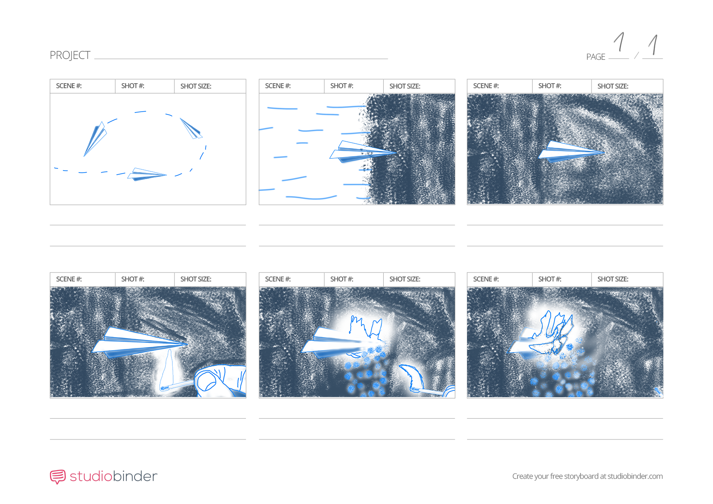
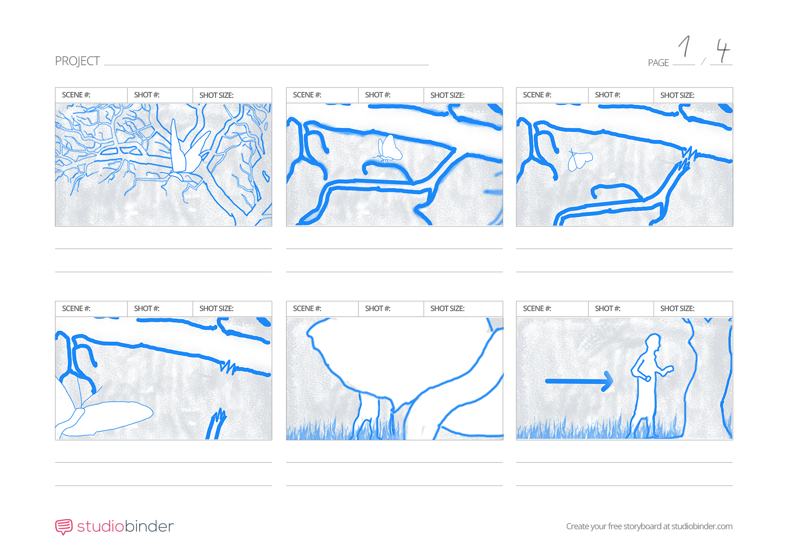

# Visual storytelling is my passion:
- **ABOUT ME**
- **FEATURED PROJECTS**

## Benjamín Haverla – Filmmaker:

In my homeland of Slovakia, the gift of nature inspires my creativity. To learn more about me, click without hesitation.

## FEATURED PROJECTS:

- Direktorenhaus (current work)
- Ai video labs (current work)
- Animation/Film instructor for kid's camp (one week per year)

**First impression** –> still searching for inspiration

**ABOUT** –> My name is Benjamín Haverla, and I live in Martin, Slovakia. I studied Information and Digital Technologies at Private Secondary Technical School in Poprad, founded by the Tatra Academy n. o. Currently, I am studying at the University of Creative Communication in Prague. I specialize in the Design Motion Copy department, which focuses on Animation and VFX.

## The project I'm working on (2023 – ???)

## Storyboard

# UKUPHILA – experimental project (2021)

# The performance in Add (2018)

